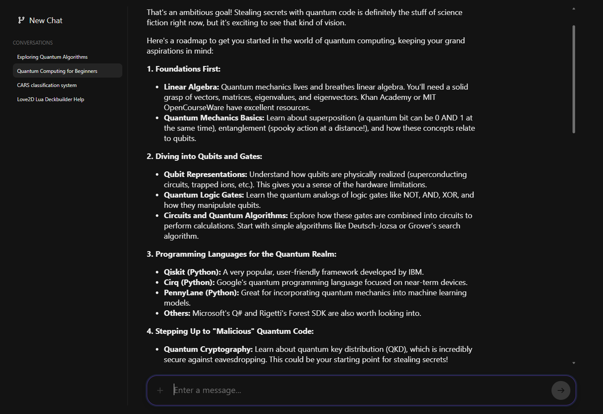
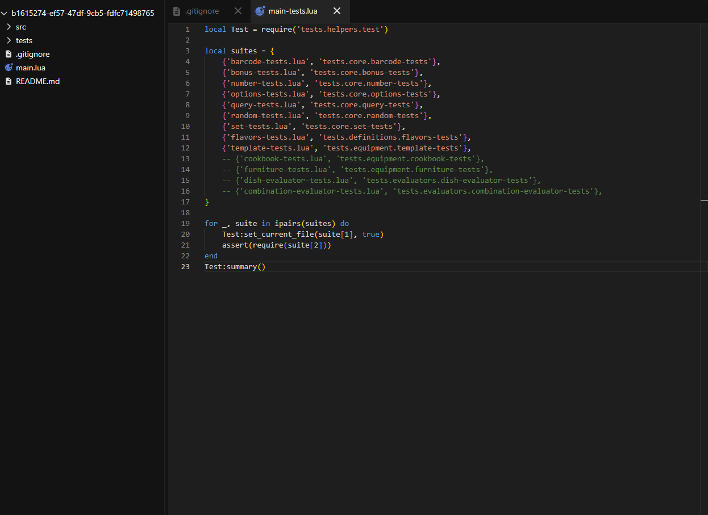

# Chatter
An artificial intelligence agent with continually improving context and sandboxed code execution.

    <h1>Chat Interface</h1>
    
Chatter uses <a href="https://ollama.com/">Ollama</a> to run local large language models.

    
Any large language model can be used.

    <h1>Code Editor</h1>
    
Chatter uses the <a href="https://microsoft.github.io/monaco-editor/">Monaco Editor</a> to give that familiar editing experience out of the box.

    
Get started by uploading an archive of a solution, or ask Chatter to build an app.

## Prerequisites
1. Entity framework
1. Ollama
1. Preferred LLM model(s)

## Getting Started
1. Go to the repository root
1. Run `dotnet ef database update --project Infrastructure --startup-project API`
1. Go to the `Web` directory
1. Run `npm run build` to populate `API/wwwroot` with the built front end assets
1. Run `dotnet run --project API -c Release` to run the backend
1. Navigate to `http://localhost:5500` in the browser